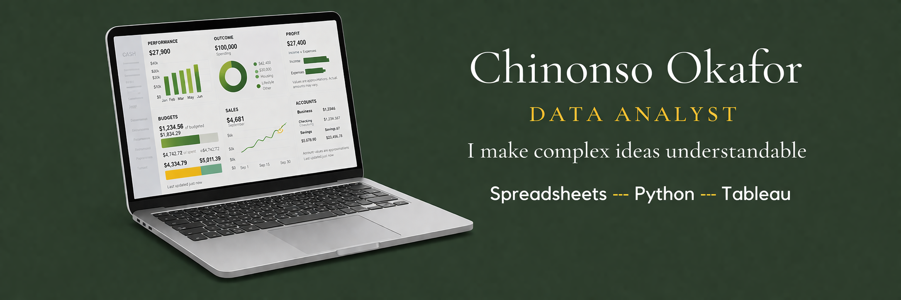

<!DOCTYPE html>
<html>
<head>
    
</head>
<body>

    

        
        <h1>Chinonso Okafor</h1>
        
<b>Data Analyst</b>

        
B.Sc. Computer Science.

         
        <a href="https://linkedin.com/in/chinonso-okafor-ab0913219" style="color: #5dade2;">LinkedIn Profile</a>
    

    

        
        
        <h2>Data Analytics Portfolio</h2>
        

        <h3>Bike Share Demand Analysis (Capstone)</h3>
        
Analyzed user behavior patterns using <b>R and Tableau</b> to drive marketing strategy recommendations.

        
        <h3>Data Integrity & Validation</h3>
        
Managed high-signal transactional data at Moniepoint, ensuring <b>100% integrity</b> through systematic tracking.

        <h3>Operational Reporting</h3>
        
Built data infrastructure for 348 personnel at Firstbank and developed analytical reports for senior management.

    

</body>
</html>
